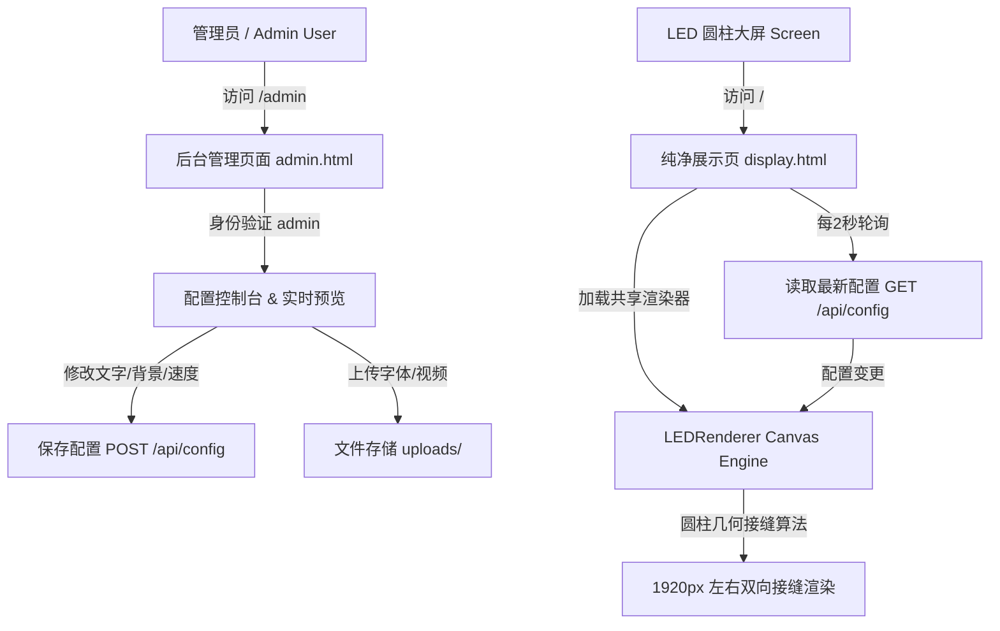

# LED 环形屏文字信息流生成器 (1920×800)

<p naming="badges">
  
  
  
  
</p>

> 专为 **圆柱形 LED 环形屏** (分辨率 1920×800) 打造的横向无缝循环信息流生成与实时展示 Web 应用。
> 
> **Powered by [bbblq](https://github.com/bbblq/led-loop)**

---

## 🌟 核心特性

- 🔄 **圆柱无缝衔接 (Cylindrical Wrap)**：精准匹配 1920px 圆柱周长。文字从屏幕左侧边缘移出的同时，**同步从右侧边缘重新入境**，无论在圆柱屏的哪个角度看，文字流动都完全连续无断裂。
- 🎨 **11 种炫酷动态背景** + 🎬 **自定义视频背景**：
  - **动态背景**：流光渐变、星空粒子、波浪动效、纯色、科技矩阵、极光效果、霓虹脉冲、星云漫游、赛博网格、火焰效果
  - **视频背景**：支持上传 `.mp4` / `.webm` 作为背景视频并自动循环播放
- 🔤 **自定义字体上传**：支持拖拽上传 `.ttf` / `.otf` / `.woff` / `.woff2` 字体文件，即上传即预览使用。
- 📺 **双路由独立设计**：
  - `/` ：**大屏展示页** (无 UI 元素纯净 Canvas，支持自动轮询后台配置并实时无刷新更新)
  - `/admin` ：**后台管理控制台** (密码鉴权保护，默认密码 `admin`)
- 📹 **高帧率 MP4 视频导出**：基于浏览器原生 WebCodecs (H.264) + `mp4-muxer` 离线逐帧渲染，可直接导出 24/30/60 FPS 的标准 `.mp4` 视频文件。
- 📦 **Docker & CasaOS 一键部署**：完整支持容器化部署与持久化存储。

---

## 📐 系统架构与工作流



---

## 🌐 路由说明

| 路由地址 | 说明 | 适用场景 |
|---|---|---|
| `http://<IP>:3000/` | **全屏大屏展示页** (纯净无控件，支持后台修改实时同步) | 直接供 LED 屏内置浏览器或播放器全屏访问 |
| `http://<IP>:3000/admin` | **后台管理控制台** (含登录鉴权，默认密码 `admin`) | 手机、电脑端远程管理与视频导出 |

---

## 🐳 Docker & CasaOS 部署指南

### 1. 使用 Docker Compose 部署 (推荐)

项目根目录已提供 `docker-compose.yml`：

```yaml
version: '3.8'

services:
  led-loop:
    image: bbblq/led-loop:latest
    container_name: led-loop
    restart: unless-stopped
    ports:
      - "3000:3000"
    volumes:
      - ./data:/app/data
      - ./uploads:/app/uploads
    environment:
      - PORT=3000
      - NODE_ENV=production
```

启动命令：
```bash
docker-compose up -d
```

### 2. 使用 Docker CLI 运行

```bash
docker run -d \
  --name led-loop \
  -p 3000:3000 \
  -v $(pwd)/data:/app/data \
  -v $(pwd)/uploads:/app/uploads \
  --restart unless-stopped \
  bbblq/led-loop:latest
```

### 3. CasaOS 部署教程

本项目完美适配 **CasaOS**，配置文件 `casaos.yml` 已内置：

#### 安装步骤：
1. 打开 CasaOS 管理界面，点击 **AppStore** 上的 **自定义安装 (Custom Install)**。
2. 点击右上角的 **导入 (Import)** 按钮。
3. 选择 **Docker Compose**，将本项目根目录下的 `casaos.yml` 内容全选复制粘贴进去。
4. 点击 **Submit** 提交后，CasaOS 将自动拉取镜像并部署完成！

---

## 🛠️ 本地开发与手动部署

### 环境要求
- Node.js 18.0+ 

### 步骤
```bash
# 1. 克隆仓库
git clone https://github.com/bbblq/led-loop.git
cd led-loop

# 2. 安装依赖
npm install

# 3. 启动服务
npm start

# 4. 访问服务
# 展示页: http://localhost:3000/
# 管理页: http://localhost:3000/admin (密码: admin)
```

---

## 💾 数据持久化说明

为了保证在容器重建或服务重启后字体、视频和配置不丢失，请挂载以下两个目录：

- `/app/data` : 存放系统配置文件 `config.json` (包含背景、颜色、文字、密码等设置)。
- `/app/uploads` : 存放用户上传的自定义字体 (`/uploads/fonts`) 和视频背景 (`/uploads/videos`)。

---

## 🔬 技术原理细节

### 圆柱无缝衔接公式 (Cylindrical Wrapping)
LED 柱子周长映射为 1920px Canvas 宽度。渲染引擎在绘制每个文字段时：
$$\text{segmentWidth} = \max(\text{textWidth} + \text{gap}, 1920)$$
$$\text{offset} = ((\text{textOffsetX} \bmod \text{segmentWidth}) + \text{segmentWidth}) \bmod \text{segmentWidth}$$

当文字左边界 $x < 0$ 且右边界 $x + \text{textWidth} > 0$ 时，在 $x + 1920$ 处补画一份副本；同理当文字超出右边界 $x + \text{textWidth} > 1920$ 时，在 $x - 1920$ 处补画一份副本。从而实现在物理拼接缝处 **100% 像素级无缝过渡**。

---

## 👨‍💻 作者与贡献

- **Author**: [bbblq](https://github.com/bbblq)
- **Repository**: [https://github.com/bbblq/led-loop](https://github.com/bbblq/led-loop)
- **Docker Hub**: [bbblq/led-loop](https://hub.docker.com/r/bbblq/led-loop)

欢迎提交 Issue 和 Pull Request！如果对你有帮助，请点个 ⭐️ **Star** 支持一下！
